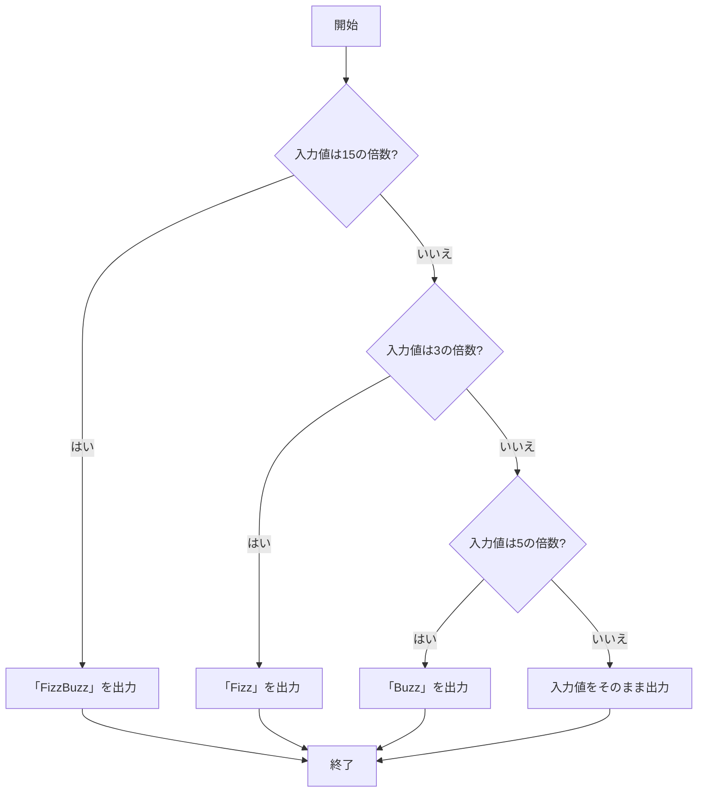

```mermaid
flowchart TD
    A[開始] --> B{入力値は15の倍数?}
    B -->|はい| C[「FizzBuzz」を出力]
    B -->|いいえ| D{入力値は3の倍数?}
    D -->|はい| E[「Fizz」を出力]
    D -->|いいえ| F{入力値は5の倍数?}
    F -->|はい| G[「Buzz」を出力]
    F -->|いいえ| H[入力値をそのまま出力]
    C --> I[終了]
    E --> I
    G --> I
    H --> I
```
